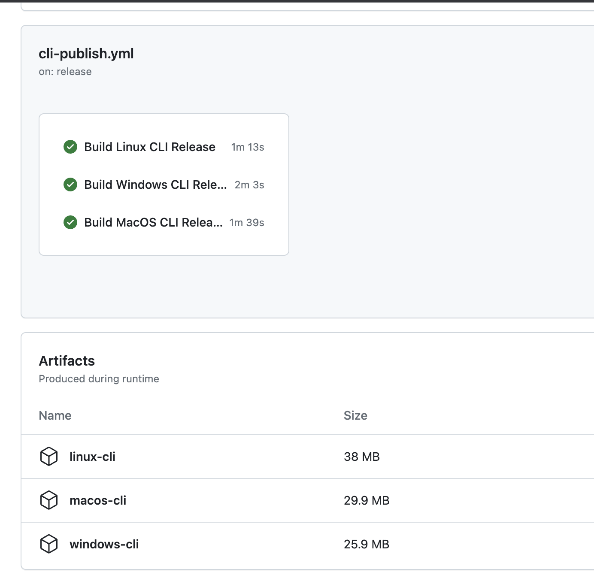

# Masked-AI
<!--  -->
<!-- [](https://badge.fury.io/py/masked-ai) -->

Masked-AI is a Python SDK and CLI wrappers that enable the usage of public LLM (Language Model) APIs such as OpenAI/GPT4 more securely.
It does this by:
1. Replacing sensitive data (for example e-mail addresses) with fake data in it's place
2. Sending the request to the API
3. Then replacing the sensitive data back into the output

The result is that you get the same output from the API, without having to send the sensitive data.

Note that we make no gurantees as to the completeness of the redaction - you remain responsible for any data you send out. For more, please see the the License.

### Flow:


  

## How to use

You can deploy Masked-AI straight from pip ("pip3 install masked-ai") or from our GitHub repo ("python3 setup.py install"). It can be used as both a python library or over the CLI.

 

### 1. Example 1: Simple `echo' command with Masked-AI:


  

### 2. Example 2: OpenAI Completion API cURL command + Masked-AI CLI tool:

```
./masker --debug --prompt "Hello, my name is Adam, say my name" curl https://api.openai.com/v1/completions  -H  "Content-Type: application/json" -H "Authorization: Bearer <OPENAI_API_KEY>"  -d  '{"model": "text-davinci-003", "prompt": "{prompt_placeholder}"}'
```

Notes:

* Don't forget to change `<OPENAI_API_KEY>` to your own OpenAI key

* Masked-AI will look for the string `{prompt_placeholder}` in the command, and will replace it with the masked `--prompt`.

  

Here is an example outout


  

**So, what is happening here?**

1. If we look at the output, the prompt that is actually being sent to the API (marked with <span style="color:#ff0000">blue</span>) is `Hello, my name is <NamesMask_1>, say my name`, Masked-AI replaces the name "Adam" with a placholder.

2. Then if we look at the raw return value from the cURL command (the important part is marked in <span style="color:red">red</span>), we can see that OpenAI returned the following completion: `Hello, <NamesMask_1>!"`

3. Lastly, the reconstruction stage (marked <span style="color:purple">purple</span>), where Masked-AI takes the output, and replace the placeholders back with the real data, which in this case, `Hello, Adam!`

 

### 3. Example 3: Same as the above, but with Python:


```python
import os
import openai
from masked_ai import Masker

# Load your API key from an environment variable or secret management service
openai.api_key = os.getenv("OPENAI_API_KEY")
data = "My name is Adam and my IP address is 8.8.8.8. Now, write a one line poem:"
masker = Masker(data)
print('Masked: ', masker.masked_data)
response = openai.Completion.create(
    model="text-davinci-003",
    prompt=masker.masked_data,
    temperature=0,
    max_tokens=1000,
)
generated_text = response.choices[0].text
print('Raw response: ', response)
unmasked = masker.unmask_data(generated_text)
print('Result:', unmasked)
```
 

## How to contribute:

The main area to contribute is to add more Masks, for example, we currently have: `IPMask`, `EmailMask`, `CreditCardMask`, and more - but there is always more to add!

Clone the repo, create a new branch, and simply go to `core/masks.py`, create a new class that inherent from `MaskBase` (in the same module), and implement the `find` method: `def find(data: str) -> Tuple[str, Dict[str, str]]:`. Once you created the class, it will automatically be part of the masking process.

Here is an example for masking IP addresses:

  

```python
class  IPMask(MaskBase):
    @staticmethod
    def  find(data: str) -> Tuple[str, Dict[str, str]]:
        return re.findall(r"\b\d{1,3}\.\d{1,3}\.\d{1,3}\.\d{1,3}\b", data)
```

And don't forget to add tests `tests/core/test_masks.py`! :)


## How to make a new release:
1. Go to the Repo's Releases page (https://github.com/cado-security/masked-ai/releases) - and click "Draft a new release"
2. Make the tag and the name of the release follow the following format: [Major].[Minor].[Patch] (i.e. 1.0.0)
3. Add release notes to the description and click "Publish Release"
4. This will kick off 2 GitHub Action Workflows:
   * Update Python PyPi Package (file: `python-publish.yml`)
   * Compile CLI Tools (file: `cli-publish.yml`)
5. Whereas the PyPi package will automatically be updated once its workflow finished, you'd need to manually copy the CLI artifacts from the "Compile CLI Tools" workflow. Just go to Actions -> click the latest "Compile CLI Tools" -> download the artifacts and upload them tp the release you just created (https://github.com/cado-security/masked-ai/releases)

