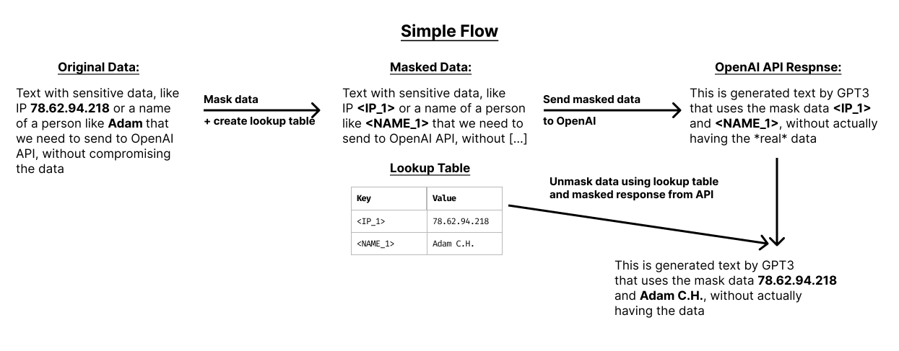
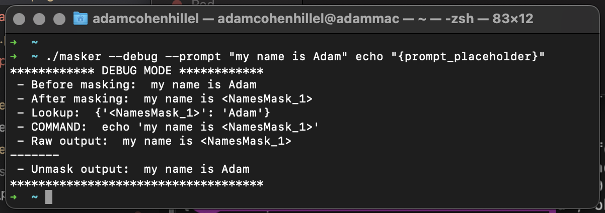
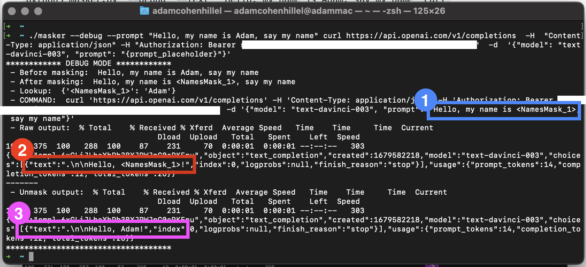

# Masked-AI

<!-- [](https://badge.fury.io/py/masked-ai) -->

Masked-AI is a Python SDK and CLI wrappers that enable the usage of public LLM (Language Model) APIs such as OpenAI/GPT4 more securely.
It does this by:
1. Replacing sensitive data (for example e-mail addresses) with fake data in it's place
2. Sending the request to the API
3. The replacing the sensitive data back into the output

The result is that you get the same output from the API, without having to send the sensitive data.

Note that we make no gurantees as to the completeness of the redaction - you remain responsible for any data you send out. For more, please see the the License.

### Flow:



  

## How to use

You can deploy Mask-AI straight from pip (“pip3 install mask-ai”) or from our GitHub repo ("python3 setup.py install"). It can be used as both a python library or over the CLI.

 

### 1. Example 1: Simple ‘echo’ command with Masked-AI:



  

### 2. Example 2: OpenAI Completion API cURL command + Masked-AI CLI tool:

```bash

python3 masker.py  --debug  --text  "Hello, my name is Adam, say my name"  \

curl https://api.openai.com/v1/completions  -H  "Content-Type: application/json"  \

-H "Authorization: Bearer <OPENAI_API_KEY>"  -d  '{"model": "text-davinci-003", "prompt": "{replace}"}'

```

Notes:

* Don’t forget to change `<OPENAI_API_KEY>` to your own OpenAI key

* Masked-AI will look for the string `{replace}` in the command, and will replace it with the masked `--text`.

  

Here is an example outout



  

**So, what is happening here?**

1. If we look at the output, the prompt that is actually being sent to the API (marked with <span style="color:#ff0000">blue</span>) is `Hello, my name is <NamesMask_1>, say my name`, Masked-AI replaces the name “Adam” with a placholder.

2. Then if we look at the raw return value from the cURL command (the important part is marked in <span style="color:red">red</span>), we can see that OpenAI returned the following completion: `Hello, <NamesMask_1>!"`

3. Lastly, the reconstruction stage (marked <span style="color:purple">purple</span>), where Masked-AI takes the output, and replace the placeholders back with the real data, which in this case, `Hello, Adam!`

 

### 3. Example 3: Same as the above, but with Python:

  

```python
import os
import openai
from masked_ai import Masker

# Load your API key from an environment variable or secret management service
openai.api_key = os.getenv("OPENAI_API_KEY")
text =  "Hello, my name is Adam, say my name"
masker = Masker(text)
# This sends "Hello, my name is <NamesMask_1>, say my name" to OpenAI
response = openai.Completion.create(model="text-davinci-003", prompt=masker.masked_data)
unmask = masker.unmask_data(response)
# This prints "Hello, Adam!"
print('Result:', unmasked)
```

  
  

## How to contribute:

The main area to contribute is to add more Masks, for example, we currently have: `IPMask`, `EmailMask`, `CreditCardMask`, and more - but there is always more to add!

Clone the repo, create a new branch, and simply go to `core/masks.py`, create a new class that inherent from `MaskBase` (in the same module), and implement the `find` method: `def find(data: str) -> Tuple[str, Dict[str, str]]:`. Once you created the class, it will automatically be part of the masking process.

Here is an example for masking IP addresses:

  

```Python

class  IPMask(MaskBase):

"""IP addresses

"""

@staticmethod

def  find(data: str) -> Tuple[str, Dict[str, str]]:

return re.findall(r"\b\d{1,3}\.\d{1,3}\.\d{1,3}\.\d{1,3}\b", data)

```

And don't forget to add tests `tests/core/test_masks.py`! :)

